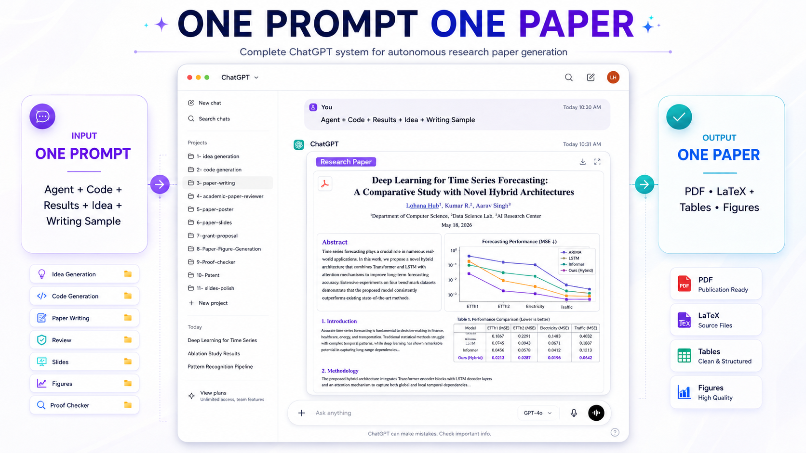
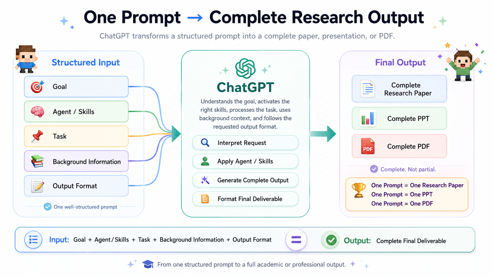
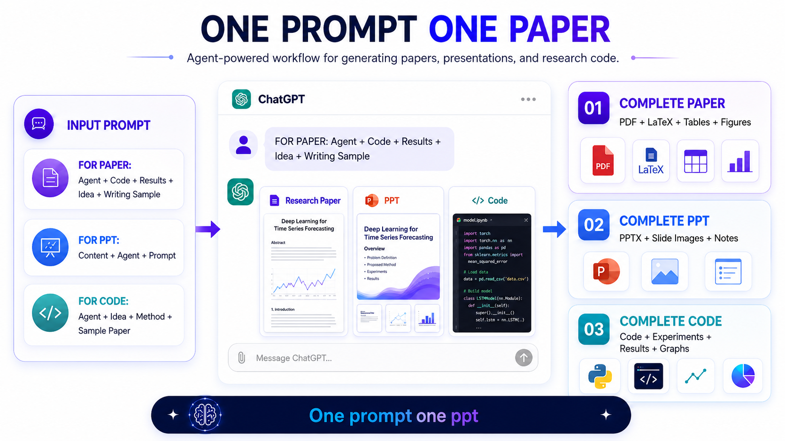

# Claude + ChatGPT Academic Research Skills: One Prompt to Papers, PPTs, PDFs, Code, and Figures

## 🎥 Watch the Demo Video

Learn how to use Claude Skills and ChatGPT to generate complete research outputs from one structured prompt.

👉 **Watch on YouTube:** [How to Create a Full Research Paper with Claude Skills](https://youtu.be/vhvtOVsnYLg)

## 🚀 One Prompt → Complete Research Output

From idea to impact — AI-powered research workflow:

### Input (One Prompt)

- **For Paper**: Agent + Code + Results + Idea + Writing Sample  
- **For PPT**: Content + Agent + Prompt  
- **For Code**: Agent + Idea + Method + Sample Paper  

### AI Agent

  

**ChatGPT AI Research Agent**  
- Read → Think → Process → Generate

### Output

- **One Paper**: PDF + LaTeX + Tables + Figures  
- **One PPT**: PPTX + Slides + Notes  
- **One Code**: Executable Code + Experiments + Graphs

---

### Workflow Stages

1. **Idea Generation** — `/idea-discovery`, `/research-lit`  
2. **Code Generation** — `/experiment-bridge`, `/run-experiment`  
3. **Paper Writing** — `/paper-writing`, `/auto-paper-improvement-loop`  
4. **Academic Paper Review** — `/auto-review-loop`, `/proof-checker`  
5. **Paper Poster** — `/paper-poster`, `/paper-illustration-image2`  
6. **Paper Slides** — `/paper-slides`, `/slides-polish`  
7. **Grant Proposal** — `/grant-proposal`  
8. **Paper Figure Generation** — `/figure-spec`, `/paper-illustration-image2`  
9. **Proof Checker** — `/proof-checker`  
10. **Patent (Optional)** — `/patent-draft`  

---

### 📚 Acknowledgements

- ARIS Methodology: [Auto-claude-code-research-in-sleep](https://github.com/wanshuiyin/Auto-claude-code-research-in-sleep)  
- PaperOrchestra: [PaperOrchestra GitHub](https://github.com/raja21068/PaperOrchestra)  

---

> *Modular, end-to-end AI workflow for autonomous research: one prompt, one agent, complete outputs.*
